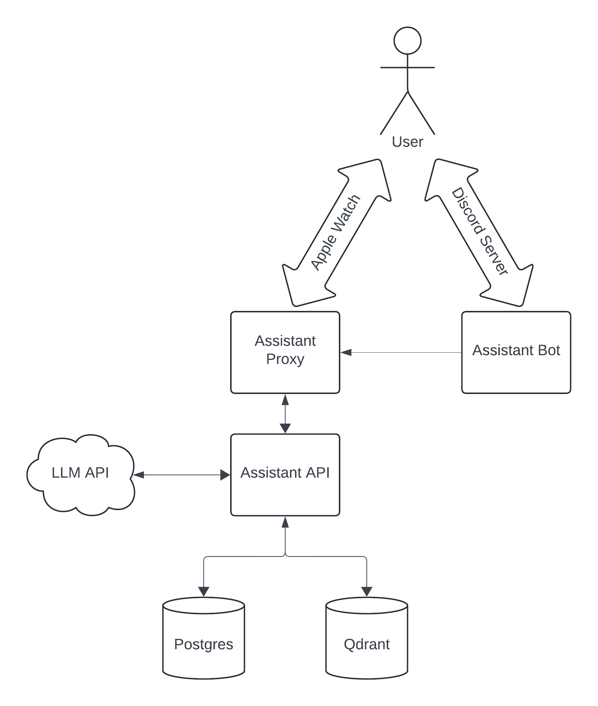

<p align="center"></p>

# Personal Assistant
A virtual personal assistant designed to simplify your daily tasks. The assistant can be accessed through the Command Line Interface (CLI) or as a Discord bot. With the assistance of Generative AI, it automates daily activities, making your life more organized and easier.

Project built for the [100 commitów](https://100commitow.pl/) competition. Its goal is to develop an open source project for 100 days.

## Technologies
[](https://skillicons.dev)

## Architecture diagram
<p align="center"></p>

## How to run?
You only need to have docker and docker-compose installed on your machine. Then you can run the following commands:
1. Clone the repository```git clone https://github.com/janbanot/personal_assistant.git```
2. Create an image with python virtual environment and install all the dependencies```bash env.sh```
3. Build the project ```bash build.sh```
    - Build the project using local docker-compose settings ```bash build.sh --local```

## Current state of the project
### Project architecture
- [x] Dockerized environment
- [x] CI/CD pipeline
- [x] test framework
- [x] the first basic tests are implemented.

### API
- [x] token-based authentication and login process
- [x] endpoint to communicate with the assistant
- [x] endpoint to get YT video summary
- [x] endpoint to get page summary

### Discord bot
- [x] bot configuration
- [x] command to communicate with the assistant
- [x] command to get YT video summary
- [x] command to get page summary
- [x] command to fix English text

### Next steps:
- Improve chatbot functionalities
- Add more commands with prompts covering frequent use cases
- Add memory to the chatbot (information about the user, context of the conversation, possibility to save data)

## Read more about the project
- [feature ideas](docs/feature_ideas.md)
- [todo list](docs/todo.md)
